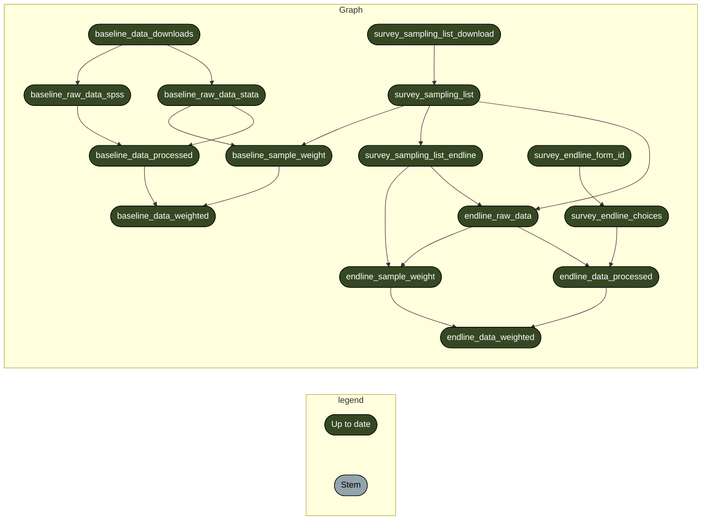

<!-- README.md is generated from README.Rmd. Please edit that file -->

# Improving Nutrition Status for under 5 children in Zambezia and Nampula project baseline and endline survey data analysis and reporting workflow

<!-- badges: start -->

[](https://github.com/katilingban/zambezia-nampula-survey/actions/workflows/test-analysis-workflow.yaml)
<!-- badges: end -->

This repository is a
[`docker`](https://www.docker.com/get-started)-containerised,
[`{targets}`](https://docs.ropensci.org/targets/)-based,
[`{renv}`](https://rstudio.github.io/renv/articles/renv.html)-enabled
[`R`](https://cran.r-project.org/) workflow developed for the data
management, data analysis, and reporting of the **Improving Nutrition
Status for under 5 Children in Zambezia and Nampula project baseline and
endline survey**.

## Repository Structure

- `data/` contains intermediate data outputs produced by the workflow
  including an endline survey codebook describing all variables of the
  endline survey;
- `R/` contains functions created for use in this workflow;
- `reports/` contains literate code for R Markdown reports generated in
  the workflow;
- `outputs/` contains compiled reports and figures;
- `auth/` contains credentials for Google service account (see below for
  more information);
- `docs/` contains archived high frequency data checks reports produced
  during the implementation of the survey;
- `_targets.R` file defines the steps in this workflow’s data management
  and analysis pipeline.

## Reproducibility

### R package dependencies

This project requires `R 4.2.2 Patched (2022-11-10 r83330)`. This
project uses the `{renv}` framework to record R package dependencies and
versions. Packages and versions used are recorded in `renv.lock` and
code used to manage dependencies is in `renv/` and other files in the
root project directory. On starting an R session in the working
directory, `run renv::restore()` to install R package dependencies.

### System requirements

This project’s data management and analysis pipeline was built to
utilise multi-threaded parallel computing to make calculations faster
and more efficient. This project’s pipeline uses 4 computing threads. To
run without issues, ensure that you use a machine with at least 5
computing threads when reproducing this pipeline (4 threads for the
pipeline and the remaininig threads to run the machines regular
processes).

With multi-threaded computation, the entire pipeline completes between
30 minutes to an hour (depending on CPU speed and RAM size). Without
multi-threading, the entire pipeline completes between 3-5 hours.

### Data management and analysis

This project uses the `{targets}` package to create its data management
and analysis pipeline as defined in the `_targets.R` file.

- To execute the data management and processing workflow for baseline
  and endline survey data, run:

``` r
targets::tar_make(baseline_data_weighted)
targets::tar_make(endline_data_weighted)
```

The schematic figure below summarises the steps in the data management
and processing workflow:

✔ Successfully auto-authenticated via
auth/mozambique-s3m-e9da207bc2a3.json



- To execute the data analysis workflow for the baseline and endline
  survey data, run:

``` r
targets::tar_make(dplyr::starts_with("baseline"))
targets::tar_make(dplyr::starts_with("endline"))
```

The schematic figure below summarises the steps in the data analysis
workflow for the baseline survey:

✔ Successfully auto-authenticated via
auth/mozambique-s3m-e9da207bc2a3.json

``` mermaid
graph LR
  subgraph legend
    x7420bd9270f8d27d([""Up to date""]):::uptodate --- x0a52b03877696646([""Outdated""]):::outdated
    x0a52b03877696646([""Outdated""]):::outdated --- xbf4603d6c2c2ad6b([""Stem""]):::none
  end
  subgraph Graph
    xaa8b198e46c12205(["baseline_data_downloads"]):::uptodate --> x34303849e9b0482a(["baseline_raw_data_spss"]):::uptodate
    x8e5c032bbae689c5(["baseline_hh_survey_design"]):::uptodate --> x65c28722c4c541d7(["baseline_demo_spouse_province"]):::uptodate
    x8e5c032bbae689c5(["baseline_hh_survey_design"]):::uptodate --> x7e2ca5f1a7bc2d3a(["baseline_women_anthro_province"]):::uptodate
    xaa8b198e46c12205(["baseline_data_downloads"]):::uptodate --> x857a1d353d27ea54(["baseline_quality_control_corrections"]):::uptodate
    x2117b40e697ef311(["baseline_child_survey_design"]):::uptodate --> x0d872772e23ce799(["baseline_child_immunisation_set2d_province"]):::uptodate
    x2117b40e697ef311(["baseline_child_survey_design"]):::uptodate --> xf9caa7798de293af(["baseline_diarrhoea_treatment_province"]):::uptodate
    x2117b40e697ef311(["baseline_child_survey_design"]):::uptodate --> x693d4e6fb71337a2(["baseline_child_immunisation_full"]):::uptodate
    xcbf2ec7505f9fcf3(["baseline_raw_data_stata"]):::uptodate --> x239e3fcdfddca386(["baseline_raw_data_sf"]):::uptodate
    xcbc9dbd4b57c3d95(["baseline_data_weighted"]):::uptodate --> x2117b40e697ef311(["baseline_child_survey_design"]):::uptodate
    x2117b40e697ef311(["baseline_child_survey_design"]):::uptodate --> xeea63605f923fa16(["baseline_child_ill"]):::uptodate
    xb8de1d18ad2cc4f6(["baseline_results_all"]):::uptodate --> xaa3f6c085cefc626(["baseline_results_csv"]):::outdated
    x2117b40e697ef311(["baseline_child_survey_design"]):::uptodate --> xcd48db4a1d86e236(["baseline_child_anthro_subset_province"]):::uptodate
    x8e5c032bbae689c5(["baseline_hh_survey_design"]):::uptodate --> x817bb22b5c5ee4f0(["baseline_natal_care_tetanus1"]):::uptodate
    x8e5c032bbae689c5(["baseline_hh_survey_design"]):::uptodate --> x0b4b1404707e3168(["baseline_natal_care_tetanus2"]):::uptodate
    x8e5c032bbae689c5(["baseline_hh_survey_design"]):::uptodate --> x7a000f4c8c3f542c(["baseline_mddw_province"]):::uptodate
    x8e5c032bbae689c5(["baseline_hh_survey_design"]):::uptodate --> x7810168d9c308ac3(["baseline_wdds_province"]):::uptodate
    x2117b40e697ef311(["baseline_child_survey_design"]):::uptodate --> xaa1983a423484b66(["baseline_ebf"]):::uptodate
    xaa8b198e46c12205(["baseline_data_downloads"]):::uptodate --> x1cc342a8767df881(["baseline_cleanstr1"]):::uptodate
    x8e5c032bbae689c5(["baseline_hh_survey_design"]):::uptodate --> xee9b8019a64d7e1a(["baseline_natal_care_malaria1"]):::uptodate
    x8e5c032bbae689c5(["baseline_hh_survey_design"]):::uptodate --> xe3d601236603ae01(["baseline_natal_care_malaria2"]):::uptodate
    x8e5c032bbae689c5(["baseline_hh_survey_design"]):::uptodate --> x562cf9e2344ebbf1(["baseline_pregnant_card_available_province"]):::uptodate
    x2117b40e697ef311(["baseline_child_survey_design"]):::uptodate --> x434e2a1eaa3155fe(["baseline_breastfeeding1_province"]):::uptodate
    x2117b40e697ef311(["baseline_child_survey_design"]):::uptodate --> xbedb906df0c59398(["baseline_iycf"]):::uptodate
    x8e5c032bbae689c5(["baseline_hh_survey_design"]):::uptodate --> x00aa41f44856a1ff(["baseline_natal_care_supplement"]):::uptodate
    x2117b40e697ef311(["baseline_child_survey_design"]):::uptodate --> xb443dfd4d1f867d4(["baseline_child_immunisation_set2a_province"]):::uptodate
    x8e5c032bbae689c5(["baseline_hh_survey_design"]):::uptodate --> x2db0fe93add39eff(["baseline_wdds"]):::uptodate
    x8e5c032bbae689c5(["baseline_hh_survey_design"]):::uptodate --> xea4286ade4747c7e(["baseline_pregnant_province"]):::uptodate
    x2117b40e697ef311(["baseline_child_survey_design"]):::uptodate --> x283593d8d266fa6c(["baseline_malaria_treatment"]):::uptodate
    x2117b40e697ef311(["baseline_child_survey_design"]):::uptodate --> x74199edb2ca8ebe2(["baseline_breastfeeding2_province"]):::uptodate
    x2117b40e697ef311(["baseline_child_survey_design"]):::uptodate --> x4bcf1c0ba29c4cb7(["baseline_child_immunisation_set2b_province"]):::uptodate
    x2117b40e697ef311(["baseline_child_survey_design"]):::uptodate --> x46d5a8beb9303803(["baseline_malaria_test_province"]):::uptodate
    x2117b40e697ef311(["baseline_child_survey_design"]):::uptodate --> x5bf9976d42df576e(["baseline_child_vita_province"]):::uptodate
    x2117b40e697ef311(["baseline_child_survey_design"]):::uptodate --> xffc8df2841a177ed(["baseline_child_immunisation_set3c_province"]):::uptodate
    x2117b40e697ef311(["baseline_child_survey_design"]):::uptodate --> xa01ad1986f4cfd2d(["baseline_diarrhoea_treatment"]):::uptodate
    xaa8b198e46c12205(["baseline_data_downloads"]):::uptodate --> x3903121677acfda6(["baseline_anthro_zscore_data"]):::uptodate
    xaa8b198e46c12205(["baseline_data_downloads"]):::uptodate --> x2c4bb1088d51cab0(["baseline_readme_text"]):::uptodate
    x2117b40e697ef311(["baseline_child_survey_design"]):::uptodate --> x6bfb54260f30240e(["baseline_demo_child"]):::uptodate
    xcbc9dbd4b57c3d95(["baseline_data_weighted"]):::uptodate --> x8e5c032bbae689c5(["baseline_hh_survey_design"]):::uptodate
    x2117b40e697ef311(["baseline_child_survey_design"]):::uptodate --> xf45435a953a692d3(["baseline_rti_treatment"]):::uptodate
    x2117b40e697ef311(["baseline_child_survey_design"]):::uptodate --> xd634e33ca6e1dae9(["baseline_child_immunisation_age_appropriate"]):::uptodate
    x14c4c0c6cf2ca972(["baseline_results_subset"]):::uptodate --> x969d7dd50bd8a411(["baseline_results_subset_csv"]):::uptodate
    xaa8b198e46c12205(["baseline_data_downloads"]):::uptodate --> x51ecb801b547b1a1(["baseline_clean_data"]):::uptodate
    x2117b40e697ef311(["baseline_child_survey_design"]):::uptodate --> x2350c8c9265432b2(["baseline_malaria_treatment_province"]):::uptodate
    x2117b40e697ef311(["baseline_child_survey_design"]):::uptodate --> xc9b380d90139bd57(["baseline_child_anthro_subset"]):::uptodate
    x8e5c032bbae689c5(["baseline_hh_survey_design"]):::uptodate --> xd0f41582775ac8c6(["baseline_natal_care_malaria1_province"]):::uptodate
    x8e5c032bbae689c5(["baseline_hh_survey_design"]):::uptodate --> x1d0df64b3351ea37(["baseline_hh_decision_province"]):::uptodate
    x8e5c032bbae689c5(["baseline_hh_survey_design"]):::uptodate --> x0051fae314f1ffbc(["baseline_natal_care_supplement_province"]):::uptodate
    xcbf2ec7505f9fcf3(["baseline_raw_data_stata"]):::uptodate --> xaa47d78bda713fd1(["baseline_sample_weight"]):::uptodate
    x2117b40e697ef311(["baseline_child_survey_design"]):::uptodate --> xaebd597fa90b4ae0(["baseline_child_immunisation_card_self_report_province"]):::uptodate
    x8e5c032bbae689c5(["baseline_hh_survey_design"]):::uptodate --> x3f3970c6fe04f38e(["baseline_wash_subset_province"]):::uptodate
    x8e5c032bbae689c5(["baseline_hh_survey_design"]):::uptodate --> x70d1c80b7e945c2a(["baseline_child_dev_province"]):::uptodate
    x2117b40e697ef311(["baseline_child_survey_design"]):::uptodate --> x109f60738b2b789c(["baseline_child_anthro"]):::uptodate
    x2117b40e697ef311(["baseline_child_survey_design"]):::uptodate --> x925bfbe821d94a46(["baseline_iycf_province"]):::uptodate
    x2117b40e697ef311(["baseline_child_survey_design"]):::uptodate --> xabeb13f50125991a(["baseline_child_immunisation_bcg_province"]):::uptodate
    x8e5c032bbae689c5(["baseline_hh_survey_design"]):::uptodate --> x17c06062b143a835(["baseline_hh_decision"]):::uptodate
    x8e5c032bbae689c5(["baseline_hh_survey_design"]):::uptodate --> x8435729ec1058b9f(["baseline_wem_province"]):::uptodate
    x2117b40e697ef311(["baseline_child_survey_design"]):::uptodate --> x80f3a98a630f6850(["baseline_child_immunisation_set3a_province"]):::uptodate
    x8e5c032bbae689c5(["baseline_hh_survey_design"]):::uptodate --> x157f3b6e965d1c04(["baseline_hh_travel"]):::uptodate
    x8e5c032bbae689c5(["baseline_hh_survey_design"]):::uptodate --> x932702a7c0dd0bfe(["baseline_observation"]):::uptodate
    x8e5c032bbae689c5(["baseline_hh_survey_design"]):::uptodate --> x9a9816ba0ce3eb1c(["baseline_demo_respondent_province"]):::uptodate
    x8e5c032bbae689c5(["baseline_hh_survey_design"]):::uptodate --> x2f10ff2d74b48b70(["baseline_hh_structure"]):::uptodate
    x8e5c032bbae689c5(["baseline_hh_survey_design"]):::uptodate --> xd770bb481d58039c(["baseline_wash"]):::uptodate
    xaa8b198e46c12205(["baseline_data_downloads"]):::uptodate --> xcbf2ec7505f9fcf3(["baseline_raw_data_stata"]):::uptodate
    x2117b40e697ef311(["baseline_child_survey_design"]):::uptodate --> xa290d0f4ecd917b3(["baseline_rti_treatment_type_province"]):::uptodate
    x8e5c032bbae689c5(["baseline_hh_survey_design"]):::uptodate --> x8b52c96acab6f0d4(["baseline_natal_care"]):::uptodate
    x8e5c032bbae689c5(["baseline_hh_survey_design"]):::uptodate --> x513d9bf28a06c793(["baseline_natal_care_malaria2_province"]):::uptodate
    x8e5c032bbae689c5(["baseline_hh_survey_design"]):::uptodate --> xf9f667d45809d096(["baseline_child_dev"]):::uptodate
    x8e5c032bbae689c5(["baseline_hh_survey_design"]):::uptodate --> x639e28ef7b090a0e(["baseline_pregnant_prevention_province"]):::uptodate
    x8e5c032bbae689c5(["baseline_hh_survey_design"]):::uptodate --> x1c8ed1df4e397734(["baseline_hh_groups"]):::uptodate
    x2117b40e697ef311(["baseline_child_survey_design"]):::uptodate --> x1a6a2aa5d0d81f56(["baseline_child_immunisation_bcg"]):::uptodate
    x2117b40e697ef311(["baseline_child_survey_design"]):::uptodate --> xe86568decacc3cde(["baseline_child_ill_province"]):::uptodate
    x2117b40e697ef311(["baseline_child_survey_design"]):::uptodate --> x7fc328525fb84724(["baseline_child_immunisation_set3b_province"]):::uptodate
    x2117b40e697ef311(["baseline_child_survey_design"]):::uptodate --> x92756ec24cf647db(["baseline_child_immunisation_opv"]):::uptodate
    x2117b40e697ef311(["baseline_child_survey_design"]):::uptodate --> xf707b56bc040870c(["baseline_child_immunisation_full_province"]):::uptodate
    xaa8b198e46c12205(["baseline_data_downloads"]):::uptodate --> xb85001564fd77c74(["baseline_raw_data_stata_with_anthro"]):::uptodate
    x34303849e9b0482a(["baseline_raw_data_spss"]):::uptodate --> x3fb2eec55e3093c2(["baseline_data_processed"]):::uptodate
    xcbf2ec7505f9fcf3(["baseline_raw_data_stata"]):::uptodate --> x3fb2eec55e3093c2(["baseline_data_processed"]):::uptodate
    x8e5c032bbae689c5(["baseline_hh_survey_design"]):::uptodate --> x4cfc07e1918961d5(["baseline_pica"]):::uptodate
    x8e5c032bbae689c5(["baseline_hh_survey_design"]):::uptodate --> xa58828ab29a8fd9a(["baseline_hh_travel_province"]):::uptodate
    x8e5c032bbae689c5(["baseline_hh_survey_design"]):::uptodate --> x2800d4d16a5e3513(["baseline_wem"]):::uptodate
    x2117b40e697ef311(["baseline_child_survey_design"]):::uptodate --> x648bcf25c9a1879a(["baseline_rti_treatment_province"]):::uptodate
    x8e5c032bbae689c5(["baseline_hh_survey_design"]):::uptodate --> x61f7db1dd5ea125e(["baseline_family_planning_province"]):::uptodate
    x3fb2eec55e3093c2(["baseline_data_processed"]):::uptodate --> xcbc9dbd4b57c3d95(["baseline_data_weighted"]):::uptodate
    xaa47d78bda713fd1(["baseline_sample_weight"]):::uptodate --> xcbc9dbd4b57c3d95(["baseline_data_weighted"]):::uptodate
    x8e5c032bbae689c5(["baseline_hh_survey_design"]):::uptodate --> x68342e368f9e53d4(["baseline_pregnant_card_available"]):::uptodate
    x2117b40e697ef311(["baseline_child_survey_design"]):::uptodate --> xf6d67a4b18034d58(["baseline_fever_treatment"]):::uptodate
    x2117b40e697ef311(["baseline_child_survey_design"]):::uptodate --> xb4fcb2cff5d70979(["baseline_deworming_province"]):::uptodate
    x8e5c032bbae689c5(["baseline_hh_survey_design"]):::uptodate --> xd3a315580ecb8301(["baseline_demo_respondent"]):::uptodate
    x2117b40e697ef311(["baseline_child_survey_design"]):::uptodate --> x19ca5d10b882251a(["baseline_child_immunisation_opv_province"]):::uptodate
    x8e5c032bbae689c5(["baseline_hh_survey_design"]):::uptodate --> x4cc24cda2fb015d7(["baseline_pregnant_vct1"]):::uptodate
    x8e5c032bbae689c5(["baseline_hh_survey_design"]):::uptodate --> xb94099d1aaccaecc(["baseline_pregnant_vct2"]):::uptodate
    x8e5c032bbae689c5(["baseline_hh_survey_design"]):::uptodate --> x321cae24eb53c811(["baseline_pregnant_vct3"]):::uptodate
    x8e5c032bbae689c5(["baseline_hh_survey_design"]):::uptodate --> xe6f553ba9c6c02bc(["baseline_observation_province"]):::uptodate
    x2117b40e697ef311(["baseline_child_survey_design"]):::uptodate --> x5c9c15e0f28d6f3e(["baseline_child_immunisation_age_appropriate_province"]):::uptodate
    x8e5c032bbae689c5(["baseline_hh_survey_design"]):::uptodate --> x99b09f734c515957(["baseline_wash_subset"]):::uptodate
    x2117b40e697ef311(["baseline_child_survey_design"]):::uptodate --> xe2b587c5128e221f(["baseline_child_immunisation_set1"]):::uptodate
    xaa8b198e46c12205(["baseline_data_downloads"]):::uptodate --> x8503cd67040c7a46(["baseline_final_dataset_processing"]):::uptodate
    x8e5c032bbae689c5(["baseline_hh_survey_design"]):::uptodate --> x310c79c65993fd0a(["baseline_pregnant_vct2_province"]):::uptodate
    x2117b40e697ef311(["baseline_child_survey_design"]):::uptodate --> x4b9d9c64c3c1b278(["baseline_demo_child_province"]):::uptodate
    x2117b40e697ef311(["baseline_child_survey_design"]):::uptodate --> x17a4a130c69b5aec(["baseline_child_immunisation_set2a"]):::uptodate
    x2117b40e697ef311(["baseline_child_survey_design"]):::uptodate --> xfdb01041999c24ea(["baseline_child_immunisation_set2b"]):::uptodate
    x2117b40e697ef311(["baseline_child_survey_design"]):::uptodate --> xa96858e7b4a81a49(["baseline_child_immunisation_set2c"]):::uptodate
    x2117b40e697ef311(["baseline_child_survey_design"]):::uptodate --> xcada786f68e934bf(["baseline_child_immunisation_set2d"]):::uptodate
    x8e5c032bbae689c5(["baseline_hh_survey_design"]):::uptodate --> xc1a6d48939dd35cf(["baseline_hh_income_province"]):::uptodate
    x2117b40e697ef311(["baseline_child_survey_design"]):::uptodate --> xd40f4f96139f2373(["baseline_child_immunisation_set3a"]):::uptodate
    x2117b40e697ef311(["baseline_child_survey_design"]):::uptodate --> x1dcf508dd49a82e0(["baseline_child_immunisation_set3b"]):::uptodate
    x2117b40e697ef311(["baseline_child_survey_design"]):::uptodate --> x75f58421e4eb04c8(["baseline_child_immunisation_set3c"]):::uptodate
    x8e5c032bbae689c5(["baseline_hh_survey_design"]):::uptodate --> xb30c042caf947405(["baseline_pregnant_card"]):::uptodate
    x8e5c032bbae689c5(["baseline_hh_survey_design"]):::uptodate --> xf99e4cc0b7407424(["baseline_hh_amenities"]):::uptodate
    x8e5c032bbae689c5(["baseline_hh_survey_design"]):::uptodate --> x009461c8e262fa4c(["baseline_demo_spouse"]):::uptodate
    x2117b40e697ef311(["baseline_child_survey_design"]):::uptodate --> x35def7d813f97a6f(["baseline_ebf_province"]):::uptodate
    x8e5c032bbae689c5(["baseline_hh_survey_design"]):::uptodate --> x4068f1554148d7a2(["baseline_hh_groups_province"]):::uptodate
    x8e5c032bbae689c5(["baseline_hh_survey_design"]):::uptodate --> x88a99e42f179a48c(["baseline_pregnant_vct1_province"]):::uptodate
    x8e5c032bbae689c5(["baseline_hh_survey_design"]):::uptodate --> xefdca93e22afa446(["baseline_mddw"]):::uptodate
    x2117b40e697ef311(["baseline_child_survey_design"]):::uptodate --> x0e2e05d535e81270(["baseline_child_immunisation_measles_province"]):::uptodate
    x8e5c032bbae689c5(["baseline_hh_survey_design"]):::uptodate --> x1b72e099b71ce485(["baseline_natal_care_tetanus1_province"]):::uptodate
    x8e5c032bbae689c5(["baseline_hh_survey_design"]):::uptodate --> x4d00f29bafcae1d6(["baseline_pregnant"]):::uptodate
    x8e5c032bbae689c5(["baseline_hh_survey_design"]):::uptodate --> xd913478327d25c66(["baseline_hh_income"]):::uptodate
    xb8de1d18ad2cc4f6(["baseline_results_all"]):::uptodate --> xe30152fe1d53bcbe(["baseline_results_xlsx"]):::outdated
    x2117b40e697ef311(["baseline_child_survey_design"]):::uptodate --> x98f562c01b0ae256(["baseline_child_vita"]):::uptodate
    x8e5c032bbae689c5(["baseline_hh_survey_design"]):::uptodate --> x8648cf32b05990b9(["baseline_pregnant_card_province"]):::uptodate
    x8e5c032bbae689c5(["baseline_hh_survey_design"]):::uptodate --> xbdd68c20e6536e77(["baseline_pica_province"]):::uptodate
    x2117b40e697ef311(["baseline_child_survey_design"]):::uptodate --> x511edc9b7c22cd0a(["baseline_child_anthro_province"]):::uptodate
    x8e5c032bbae689c5(["baseline_hh_survey_design"]):::uptodate --> x4477ba39b461792b(["baseline_wash_province"]):::uptodate
    x8e5c032bbae689c5(["baseline_hh_survey_design"]):::uptodate --> xfc5c89f7c3625b35(["baseline_natal_care_tetanus2_province"]):::uptodate
    x2117b40e697ef311(["baseline_child_survey_design"]):::uptodate --> x27241b4608ac8229(["baseline_child_immunisation_card_available_province"]):::uptodate
    x8e5c032bbae689c5(["baseline_hh_survey_design"]):::uptodate --> x7dead7ad70154739(["baseline_hh_amenities_province"]):::uptodate
    x2117b40e697ef311(["baseline_child_survey_design"]):::uptodate --> x3e3cb430cdffb172(["baseline_rti_treatment_type"]):::uptodate
    x2117b40e697ef311(["baseline_child_survey_design"]):::uptodate --> x508aefe969ba35b2(["baseline_fever_treatment_province"]):::uptodate
    x8e5c032bbae689c5(["baseline_hh_survey_design"]):::uptodate --> xa04476ac840fe70f(["baseline_hh_structure_province"]):::uptodate
    x2117b40e697ef311(["baseline_child_survey_design"]):::uptodate --> x2469da46022672e9(["baseline_deworming"]):::uptodate
    x8e5c032bbae689c5(["baseline_hh_survey_design"]):::uptodate --> xad18e17591d1c027(["baseline_pregnant_vct3_province"]):::uptodate
    x8e5c032bbae689c5(["baseline_hh_survey_design"]):::uptodate --> xfe63bc5af031a4f8(["baseline_women_phq8"]):::uptodate
    x2117b40e697ef311(["baseline_child_survey_design"]):::uptodate --> xd57db178f4bbc608(["baseline_child_immunisation_card_self_report"]):::uptodate
    x2117b40e697ef311(["baseline_child_survey_design"]):::uptodate --> xf78fa52a2655abb2(["baseline_child_immunisation_card_available"]):::uptodate
    x8e5c032bbae689c5(["baseline_hh_survey_design"]):::uptodate --> x631de968eff2aea2(["baseline_women_phq8_province"]):::uptodate
    x2117b40e697ef311(["baseline_child_survey_design"]):::uptodate --> xe106bb47fe4e89da(["baseline_child_immunisation_set1_province"]):::uptodate
    x2117b40e697ef311(["baseline_child_survey_design"]):::uptodate --> xb5cc3c17185d4f9d(["baseline_breastfeeding1"]):::uptodate
    x2117b40e697ef311(["baseline_child_survey_design"]):::uptodate --> xa191de71dc8f63d1(["baseline_breastfeeding2"]):::uptodate
    x2117b40e697ef311(["baseline_child_survey_design"]):::uptodate --> x12129995caee8fe1(["baseline_child_immunisation_measles"]):::uptodate
    x8e5c032bbae689c5(["baseline_hh_survey_design"]):::uptodate --> x4c58e8f5cafc454a(["baseline_pregnant_prevention"]):::uptodate
    x2117b40e697ef311(["baseline_child_survey_design"]):::uptodate --> x653d856a5beb5654(["baseline_child_immunisation_set2c_province"]):::uptodate
    x8e5c032bbae689c5(["baseline_hh_survey_design"]):::uptodate --> x62274537e70bf125(["baseline_family_planning"]):::uptodate
    x8e5c032bbae689c5(["baseline_hh_survey_design"]):::uptodate --> x1181c6030095ed31(["baseline_women_anthro"]):::uptodate
    x2117b40e697ef311(["baseline_child_survey_design"]):::uptodate --> xff225152e3d431b9(["baseline_malaria_test"]):::uptodate
    x8e5c032bbae689c5(["baseline_hh_survey_design"]):::uptodate --> x1c941969a3722994(["baseline_natal_care_province"]):::uptodate
    x02fbd9452a16eea6(["baseline_survey_results_report"]):::outdated --> x02fbd9452a16eea6(["baseline_survey_results_report"]):::outdated
  end
  classDef uptodate stroke:#000000,color:#ffffff,fill:#354823;
  classDef outdated stroke:#000000,color:#000000,fill:#78B7C5;
  classDef none stroke:#000000,color:#000000,fill:#94a4ac;
  linkStyle 0 stroke-width:0px;
  linkStyle 1 stroke-width:0px;
  linkStyle 148 stroke-width:0px;
```

## Encryption

This repository uses `git-crypt` to enable transparent encryption and
decryption of the `.env` file and the `auth/` directory.

The `.env` file contains:

- variables for authenticating with Google Cloud services account setup
  for this project for accessing the baseline survey data;

- variables for accessing the endline survey data direct from ONA;

- variables for `SMTP_PASSWORD` and `EMAIL_RECIPIENTS` which are used
  for sending the email updates for the high frequency data checks.

The `auth/` directory contains credentials for Google service account.

Those who would like to reproduce the results of this project will
require ability to decrypt the `.env` file and the `auth/` directory.

To be able to work on this repository, a user/collaborator on this
project will need to:

- Create their own **PGP (Pretty Good Privacy) public and private
  keys**; and,

- Share their public key to the authors and request for it to be added
  to the repository.

Once added, a collaborator can now decrypt the `.env` file and the
`auth/` directory after pulling/cloning the repository by running:

    git-crypt unlock

on the terminal.

## Authors

- Mark Myatt
- Ernest Guevarra

## License

The datasets for both baseline and endline survey (not included in this
repository) are owned by **UNICEF Mozambique**. Access to these datasets
is restricted. Communicate with **UNICEF Mozambique** to request access
to the survey datasets.

The code included in this repository is owned by the authors and is
licensed under a [GNU General Public License 3
(GPL-3)](https://opensource.org/licenses/GPL-3.0).

## Feedback

Feedback, bug reports and feature requests are welcome; file issues or
seek support
[here](https://github.com/katilingban/zambezia-nampula-survey/issues).
