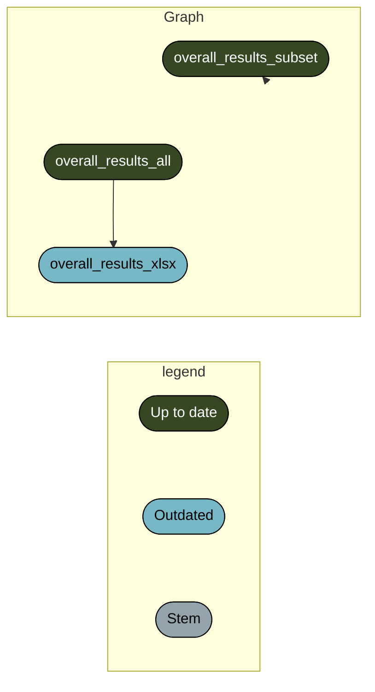

<!-- README.md is generated from README.Rmd. Please edit that file -->

# Improving Nutrition Status for under 5 children in Zambezia and Nampula project baseline and endline survey data analysis and reporting workflow

<!-- badges: start -->

[](https://github.com/katilingban/zambezia-nampula-survey/actions/workflows/test-analysis-workflow.yaml)
<!-- badges: end -->

This repository is a
[`docker`](https://www.docker.com/get-started)-containerised,
[`{targets}`](https://docs.ropensci.org/targets/)-based,
[`{renv}`](https://rstudio.github.io/renv/articles/renv.html)-enabled
[`R`](https://cran.r-project.org/) workflow developed for the data
management, data analysis, and reporting of the **Improving Nutrition
Status for under 5 Children in Zambezia and Nampula project baseline and
endline survey**.

## Repository Structure

- `data/` contains intermediate data outputs produced by the workflow
  including an endline survey codebook describing all variables of the
  endline survey;
- `R/` contains functions created for use in this workflow;
- `reports/` contains literate code for R Markdown reports generated in
  the workflow;
- `outputs/` contains compiled reports and figures;
- `auth/` contains credentials for Google service account (see below for
  more information);
- `docs/` contains archived high frequency data checks reports produced
  during the implementation of the survey;
- `_targets.R` file defines the steps in this workflow’s data management
  and analysis pipeline.

## Reproducibility

### R package dependencies

This project requires `R 4.2.2 Patched (2022-11-10 r83330)`. This
project uses the `{renv}` framework to record R package dependencies and
versions. Packages and versions used are recorded in `renv.lock` and
code used to manage dependencies is in `renv/` and other files in the
root project directory. On starting an R session in the working
directory, `run renv::restore()` to install R package dependencies.

### System requirements

This project’s data management and analysis pipeline was built to
utilise multi-threaded parallel computing to make calculations faster
and more efficient. This project’s pipeline uses 4 computing threads. To
run without issues, ensure that you use a machine with at least 5
computing threads when reproducing this pipeline (4 threads for the
pipeline and the remaininig threads to run the machines regular
processes).

With multi-threaded computation, the entire pipeline completes between
30 minutes to an hour (depending on CPU speed and RAM size). Without
multi-threading, the entire pipeline completes between 3-5 hours.

### Data management and analysis

This project uses the `{targets}` package to create its data management
and analysis pipeline as defined in the `_targets.R` file.

- To execute the data management and processing workflow for baseline
  and endline survey data, run:

``` r
targets::tar_make(baseline_data_weighted)
targets::tar_make(endline_data_weighted)
```

The schematic figure below summarises the steps in the data management
and processing workflow:

✔ Successfully auto-authenticated via
auth/mozambique-s3m-e9da207bc2a3.json


- To execute the data analysis workflow for the baseline and endline
  survey data, run:

``` r
targets::tar_make(dplyr::starts_with("baseline"))
targets::tar_make(dplyr::starts_with("endline"))
```

The schematic figure below summarises the steps in the data analysis
workflow for the baseline survey:

✔ Successfully auto-authenticated via
auth/mozambique-s3m-e9da207bc2a3.json



## Encryption

This repository uses `git-crypt` to enable transparent encryption and
decryption of the `.env` file and the `auth/` directory.

The `.env` file contains:

- variables for authenticating with Google Cloud services account setup
  for this project for accessing the baseline survey data;

- variables for accessing the endline survey data direct from ONA;

- variables for `SMTP_PASSWORD` and `EMAIL_RECIPIENTS` which are used
  for sending the email updates for the high frequency data checks.

The `auth/` directory contains credentials for Google service account.

Those who would like to reproduce the results of this project will
require ability to decrypt the `.env` file and the `auth/` directory.

To be able to work on this repository, a user/collaborator on this
project will need to:

- Create their own **PGP (Pretty Good Privacy) public and private
  keys**; and,

- Share their public key to the authors and request for it to be added
  to the repository.

Once added, a collaborator can now decrypt the `.env` file and the
`auth/` directory after pulling/cloning the repository by running:

    git-crypt unlock

on the terminal.

## Authors

- Mark Myatt
- Ernest Guevarra

## License

The datasets for both baseline and endline survey (not included in this
repository) are owned by **UNICEF Mozambique**. Access to these datasets
is restricted. Communicate with **UNICEF Mozambique** to request access
to the survey datasets.

The code included in this repository is owned by the authors and is
licensed under a [GNU General Public License 3
(GPL-3)](https://opensource.org/licenses/GPL-3.0).

## Feedback

Feedback, bug reports and feature requests are welcome; file issues or
seek support
[here](https://github.com/katilingban/zambezia-nampula-survey/issues).
